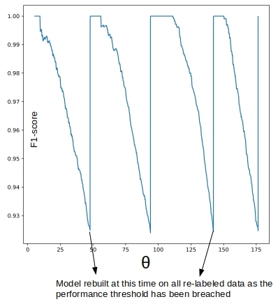

# DMEyF - Experimentos colaborativos

## Estabilidad de modelos en el tiempo

### Hipótesis
Las series de tiempo son colecciones de observaciones sobre un determinado fenómeno efectuadas en sucesivos momentos del tiempo, usualmente equiespaciados.
Corresponde a una realización de un proceso generador de datos.  En nuestro caso, creemos que la recurrente inclusión del último mes en el entrenamiento del modelo, predice para mes + 2, una ganancia mayor a la obtenida cuando se utiliza un modelo único y fijo para todo el año.

### Sesgos Cognitivos
El rendimiento de un modelo (que no se re-entrena) decae en el tiempo. No obstante, no quiero ser tan optimista de mantenerlo estático durante un año ni tan pesimista de creer que en un mes ocurre tanto drift como para re-entrenarlo. Además, si se incluye la optimización bayesiana (48h) es tema de nunca acabar. Entre el optimismo y pesimismo definir un punto medio:
A menos que se queme el banco o todos los clientes corten sus tarjetas al tiempo, el drift entre un par de meses contiguos es mínimo, por lo que el modelo puede continuar prediciendo hasta que el drift muestre su peor versión y, únicamente, en ese momento conviene hacer un esfuerzo para construir una nueva versión del modelo. Definir cuánta ganancia me permito ceder con tal de reducir el esfuerzo de re-entrenar mes a mes.

- Conforme pasa el tiempo el performance del modelo se degrada (como se muestra en la siguiente imagen)
- Esa degradación no es tan repentina como para hacerlo mes a mes
- Model-centric MLOps está cada vez más en desuso

### Diseño experimental

#### Modelos

##### Baseline
- El modelo se entrena y valida una única vez
- El modelo se usa para realizar predicciones durante el último trimestre de 2020 y los primeros nueve meses del 2021
  - Para cada mes se calculan las métricas de clasificación: accuracy, F1-score, etc.
  - Se espera un decaimiento en cada una de las métricas conforme los meses pasan

###### Actualización mensual:
- Conforme avanza el año se incluyen los datos nuevos en el dataset entrenamiento

###### Validación adversaria
Requiere el uso de dos modelos `modelo adversario` y `modelo en producción`.

El modelo adversario comparará los datos de entrenamiento del modelo en producción con los datos «nuevos» que llegan cada mes para estimar si el cliente continúa o no. El pipeline para la construcción del modelo adversario consta de:
1. Entrenar el modelo en «producción»
   - Guardar los datos de entrenamiento, ahora llamados `entrenamiento`.
   - Guardar los datos usados para inferencia, ahora llamados `producción`.
2. Crear la variable objetivo del modelo adversario
   - Reemplazar la variable target del dataset de `entrenamiento` por un label arbitrario: `0`.
   - Agregar la variable target al dataset de `producción` con un label arbitrario: `1`.
3. Generar dataset adversario
   - Mezclar `\& randomize` ambos datasets con target adversario `{0, 1}`
4. Entrenamiento modelo adversario
   - Elegir un modelo de alto sesgo y baja varianza como `Tree`, `Logistic Regression` or `Random Forest`
   - Calcular el área bajo la curva `ROC`

_Los pasos 1-3 se repiten cuantas veces sea necesario conforme los meses van pasando. Una vez la `ROC AUC` supere el threshold definido se deja de considerar como un modelo válido._

El modelo en producción se entrena una vez el modelo adversario ha superado el threshold definido.

**¿Por qué tiene sentido usar un modelo adversario?**

El modelo adversario no podrá distinguir las clases en el dataset adversario si los datos tienen una distribución igual/similar

> i.e ROC AUC ~ 0.5

El modelo adversario adquirirá un mayor poder predictivo si las distribuciones son distintas

> i.e ROC AUC > 0.5

#### Variable objetivo:
Se calcula hasta la fecha en la que se aplica el modelo
- Mes a mes
- Una vez aparezca drift

#### Métricas:
Se calculan (`ganancia`, `accuracy`, `f-score`, etc) para cada mes respecto a:
- La variable que se calcula cada mes
- Ya que se tienen datos hasta `2021-09` se puede comparar con la `real`

### Bibliografía
